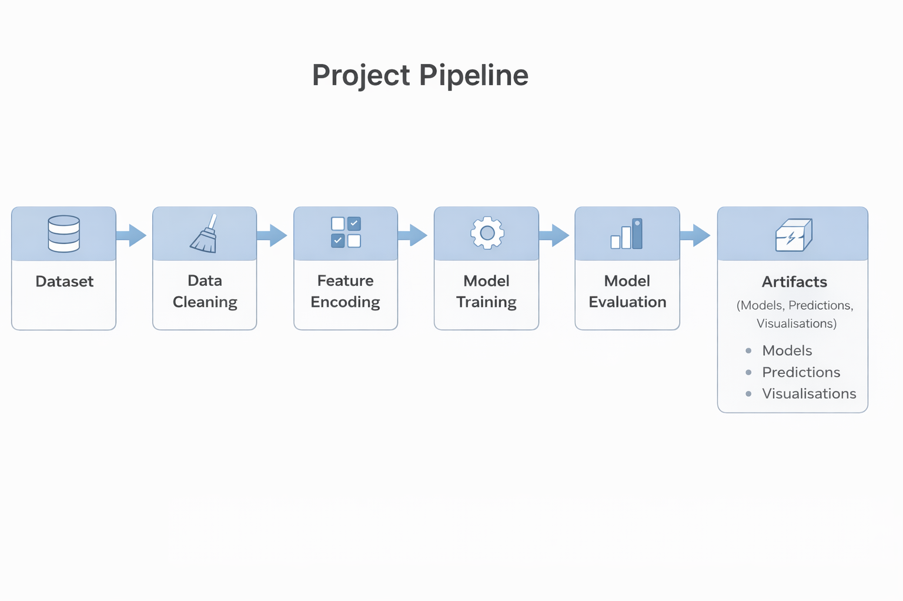
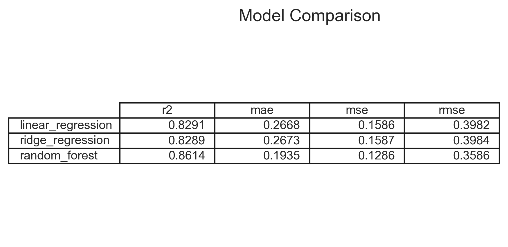
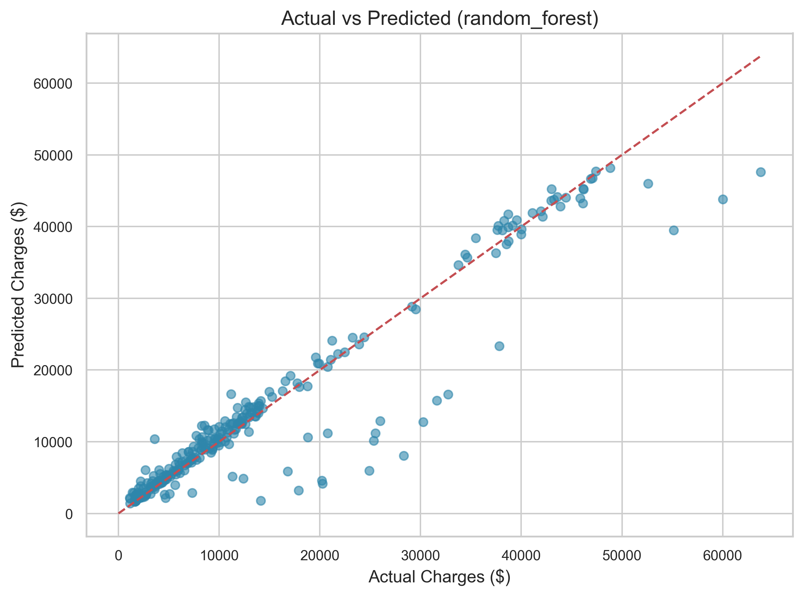
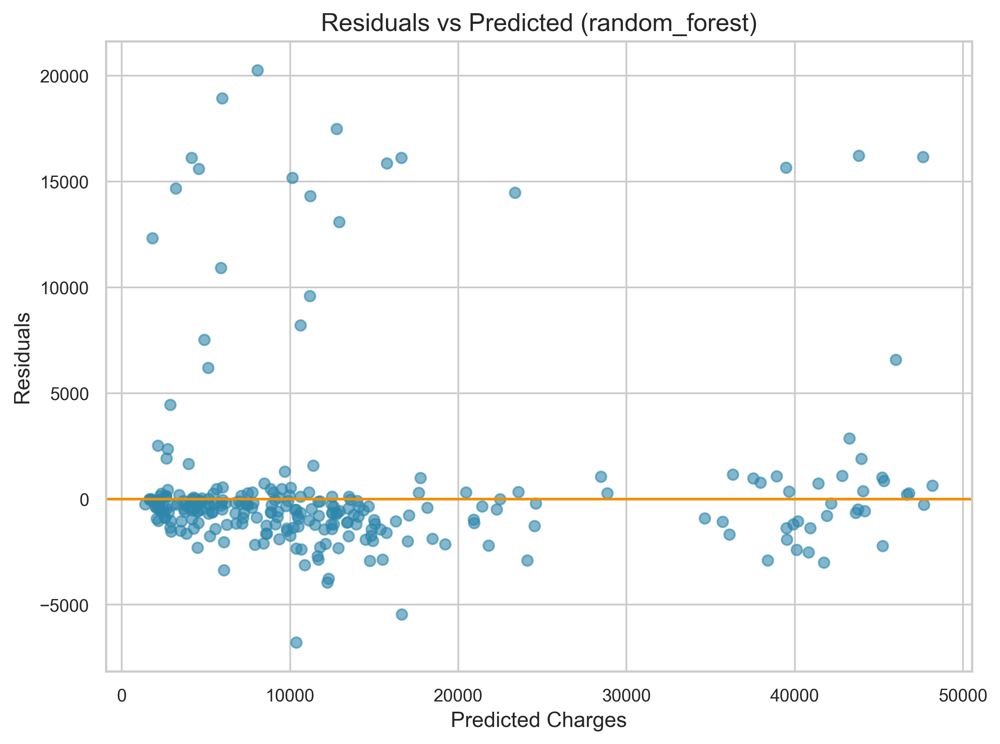
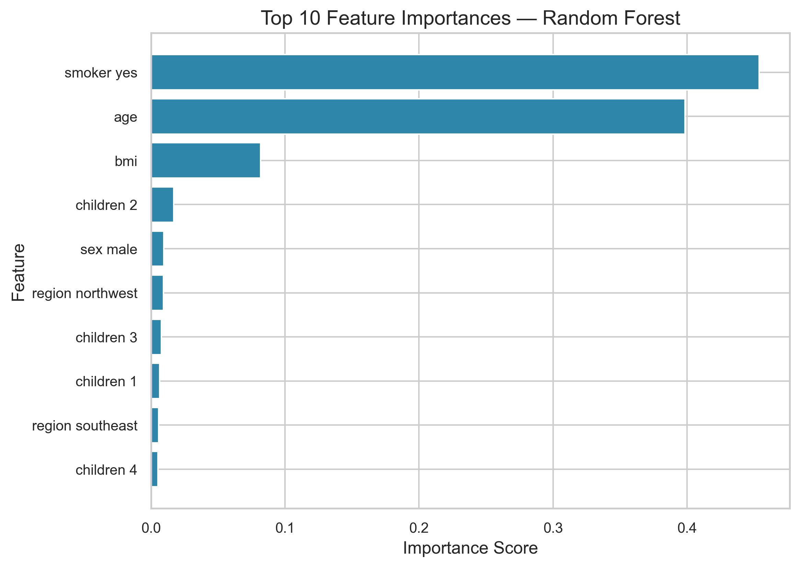
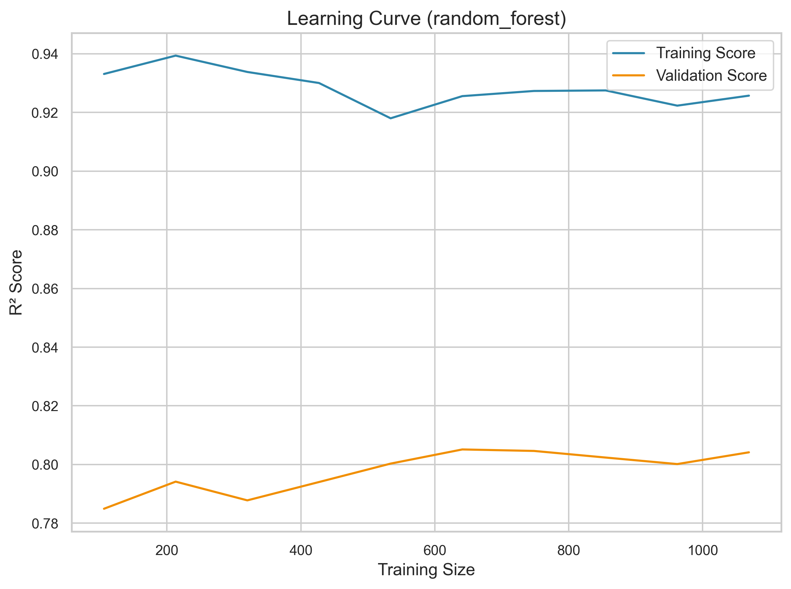

# Medical Insurance Pricing Prediction


End-to-end machine learning project for predicting **medical insurance charges** using demographic and lifestyle data.

The project demonstrates a complete ML workflow including **data preprocessing, feature engineering, regression model comparison, diagnostic visualisations, and reproducible training scripts**.

---

# Project Overview

Insurance providers estimate healthcare costs using demographic and demographic and lifestyle risk factors.

This project builds machine learning models to predict **insurance charges** and compares the performance of **linear models vs tree-based models**.

Models implemented:

* Linear Regression
* Ridge Regression
* Random Forest Regressor

Random Forest produced the best performance by capturing nonlinear relationships between variables.

---


# Project Pipeline



Pipeline stages:

1. Dataset loading
2. Data cleaning and validation
3. Feature encoding
4. Model training
5. Model evaluation
6. Artifact generation

Artifacts include trained models, evaluation metrics, predictions, and visualisations.

---

# Dataset

The dataset contains **1,338 insurance records** with the following features:

| Feature  | Description            |
| -------- | ---------------------- |
| age      | Age of the individual  |
| sex      | Gender                 |
| bmi      | Body Mass Index        |
| children | Number of dependents   |
| smoker   | Smoking status         |
| region   | Geographic region      |
| charges  | Medical insurance cost |

The target variable **charges** is **log-transformed during modelling** to stabilise variance and improve regression performance.

---

# Model Performance

| Model             | R²         | MAE        | MSE        | RMSE       |
| ----------------- | ---------- | ---------- | ---------- | ---------- |
| Linear Regression | 0.8295     | 0.2607     | 0.1582     | 0.3978     |
| Ridge Regression  | 0.8293     | 0.2610     | 0.1584     | 0.3980     |
| Random Forest     | **0.8705** | **0.1812** | **0.1201** | **0.3466** |

Random Forest achieved the strongest performance, indicating nonlinear relationships between insurance risk factors.

## Example Predictions

| Actual | Predicted |
|------|------|
| 16884 | 17291 |
| 1725 | 2597 |
| 4449 | 4588 |
---

# Model Diagnostics

## Model Comparison

The table below compares the regression models used in this project.



Random Forest achieved the best performance among the evaluated models.

---

## Actual vs Predicted Charges

This plot compares predicted charges with the true insurance costs.

Points close to the diagonal line represent accurate predictions.



---

## Residual Analysis

Residuals represent prediction errors.

A well-performing model should show residuals randomly scattered around zero.



---

## Feature Importance

Feature importance shows which variables most influence the model’s predictions.

Smoking status is the most significant predictor of insurance charges.



---

## Learning Curve

The learning curve illustrates how model performance improves as more training data is used.

It helps identify whether the model suffers from high bias or high variance.



---

# Repository Structure

```
medical-insurance-pricing
│
├── data
│   └── raw
│       └── insurance.csv
│
├── notebooks
│   └── exploratory_analysis_and_modeling.ipynb
│
├── src
│   ├── config.py
│   ├── preprocess.py
│   ├── train.py
│   ├── evaluate.py
│   ├── predict.py
│   ├── utils.py
│   └── __init__.py
│
├── scripts
│   ├── run_prediction.py
│   └── test_pipeline.py
│
├── models
│   └── best_model_random_forest.joblib
│
├── reports
│   ├── metrics.json
│   ├── model_comparison.csv
│   └── predictions.csv
│
├── images
│   ├── project_pipeline.png
│   ├── model_comparison.png
│   ├── actual_vs_predicted.png
│   ├── residuals_best_model.png
│   ├── feature_importance.png
│   └── learning_curve.png
│
├── MODEL_CARD.md   
├── README.md
├── requirements.txt
└── LICENSE
```
The notebook contains exploratory data analysis and early modelling experiments before implementing the production-style machine learning pipeline in the src/ directory.

### Notebook location:
notebooks/exploratory_analysis_and_modeling.ipynb

---

# Reproducible ML Pipeline

This project is designed as a **fully reproducible machine learning pipeline**.

Running the training script performs the following steps automatically:

1. Load and validate the dataset
2. Clean and preprocess features
3. Encode categorical variables
4. Train multiple regression models
5. Evaluate model performance
6. Select the best performing model
7. Save artifacts and diagnostic visualisations

The pipeline generates the following outputs:

| Artifact                                 | Description                         |
| ---------------------------------------- | ----------------------------------- |
| `models/best_model_random_forest.joblib` | Serialized trained model            |
| `reports/metrics.json`                   | Model performance metrics           |
| `reports/model_comparison.csv`           | Comparison of regression models     |
| `reports/predictions.csv`                | Predictions on the test set         |
| `images/*.png`                           | Diagnostic plots and visualisations |

All artifacts can be regenerated by running:

```bash
py -m src.train
```

---

# How to Run

Clone the repository and run the full machine learning pipeline.

```bash
git clone https://github.com/your-username/medical-insurance-pricing.git
cd medical-insurance-pricing
```

### 1. Create a virtual environment

```bash
python -m venv .venv

# Windows
.venv\Scripts\activate

# Mac / Linux
source .venv/bin/activate
```

### 2. Install dependencies

Dependencies are listed in `requirements.txt`.

```bash
pip install -r requirements.txt
```

### 3. Train models

Run the training pipeline:

```bash
py -m src.train
```

Artifacts generated:

```
models/best_model_random_forest.joblib
reports/metrics.json
reports/model_comparison.csv
reports/predictions.csv
images/*.png
```

### 4. Run prediction example

```bash
py scripts/run_prediction.py
```

Example output:

```
Predicted insurance charges: [12874.52]
```

---

# Example Prediction (Python)

```python
from src.predict import load_model, predict
import pandas as pd

model = load_model("models/best_model_random_forest.joblib")

sample = pd.DataFrame({
    "age":[40],
    "sex":["male"],
    "bmi":[28],
    "children":[2],
    "smoker":["no"],
    "region":["southeast"]
})

predict(model, sample)
```

After running the pipeline you will see the following directories populated with artifacts:

```
models/
reports/
images/
```

These contain the trained model, evaluation metrics, predictions, and diagnostic plots.

---

# Test the End-to-End Pipeline

A lightweight pipeline test is included to verify that the full ML workflow executes correctly.

The test script performs the following checks:

* Loads the dataset
* Loads the trained model
* Runs the preprocessing pipeline
* Generates predictions
* Confirms the pipeline executes without errors

Run the pipeline test with:

```bash
py scripts/test_pipeline.py
```

Example output:

```
Starting pipeline test...
Data loaded: (1338, 7)
Model loaded successfully
Predictions generated: 1338
Sample predictions: [17291.47 2597.74 4588.66 10079.57 4396.03]
Pipeline test completed successfully
```

---

# Key Insights

* Smoking status strongly influences insurance pricing
* BMI and age significantly impact medical costs
* Nonlinear models capture feature interactions better than linear models
* Log-transforming the target improves regression stability

---

# Future Improvements

* Hyperparameter tuning
* Model explainability using SHAP
* Feature interaction analysis

---

# License

MIT License (see `LICENSE`)
